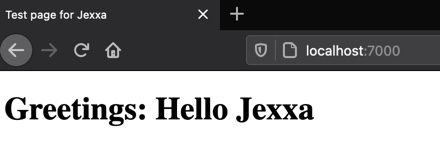

# HelloJexxa #

## What You Learn ##

*   How to write a simple application using Jexxa
*   How to bind different driving adapter to the `BoundedContext` object which allow to control your application from outside
*   How to control the running application from outside via `BoundedContext` object 
*   How to use the `jexxa-application.properties` to configure the driving adapters
*   How to build a docker image with this tutorial    

## What you need ##

*   15 minutes
*   JDK 11 (or higher) installed 
*   Maven 3.6 (or higher) installed
*   Docker installed (optional)

## Write the application ##

The source code of the main method is quite obvious. Each line include comments to explain the meaning.  

```java     
public final class HelloJexxa
{
    public String greetings()
    {
        return "Hello Jexxa";
    }

    public static void main(String[] args)
    {
        //Create your jexxaMain for this application
        var jexxaMain = new JexxaMain("HelloJexxa");

        jexxaMain
                // Bind a JMX adapter to our BoundedContext object.
                // It allows to access the public methods of the object via `jconsole`
                .bind(JMXAdapter.class).to(jexxaMain.getBoundedContext())

                // Bind a REST adapter to a HelloJexxa object
                .bind(RESTfulRPCAdapter.class).to(HelloJexxa.class)

                //Start Jexxa and all bindings
                // - Open following URL in browser to get greetings: http://localhost:7500/HelloJexxa/greetings
                // - You can also use curl: `curl -X GET http://localhost:7500/HelloJexxa/greetings`
                .start()

                //Wait until shutdown is called by one of the following options:
                // - Press CTRL-C
                // - Use `jconsole` to connect to this application and invoke method shutdown
                .waitForShutdown()

                //Finally invoke stop() for proper cleanup
                .stop();
    }
}
```

## Compile & Start the Application ##
```console                                                          
mvn clean install
java -jar target/hellojexxa-jar-with-dependencies.jar
```
You will see following (or similar) output
```console
[main] INFO io.jexxa.core.JexxaMain - Start BoundedContext 'HelloJexxa' with 2 Driving Adapter 
[main] INFO org.eclipse.jetty.util.log - Logging initialized @446ms to org.eclipse.jetty.util.log.Slf4jLog
[main] INFO io.javalin.Javalin - Starting Javalin ...
[main] INFO io.javalin.Javalin - Listening on http://localhost:7500/
[main] INFO io.javalin.Javalin - Javalin started in 194ms \o/
[main] INFO io.jexxa.core.JexxaMain - BoundedContext 'HelloJexxa' successfully started in 0.549 seconds
```

## Access the application ##

### Using a web browser ###
*   Get name of the bounded context:
    *   URL: http://localhost:7500/HelloJexxa/greetings
    *   Result: 
    ```Json 
        Hello Jexxa 
    ```

### Adjust properties ###
In this simple tutorial `jexxa-application.properties` includes only the two parameters for RESTFulRPCAdapter.
The most interesting one here is `io.jexxa.rest.port` that allows to define the used network port.

```properties                                                          
#Settings for RESTfulRPCAdapter
#Note: Setting host to 0.0.0.0 starts listening on all network devices 
io.jexxa.rest.host=0.0.0.0
io.jexxa.rest.port=7500
```

### Access provided web pages ###
You can also define a path to static web pages in properties as follows. 
```properties                                                          
#Settings for RESTfulRPCAdapter
...
io.jexxa.rest.static_files_root=/public
```

Note: This directory is relative to the class path of the application. From a web client it is accessed without any other prefix. 

This tutorial provides a simple web page which performs the previous `GET`. The html page itself can be found [here](src/main/resources/public/index.html).

The web page can be accessed via following link [http://localhost:7500/index.html](http://localhost:7500/index.html) and looks as follows: 


    
### Use JConsole ###

*   Start jconsole and select the MBean `BoundedContext` as shown in screenshot below
*   Now you can execute all methods of this object

 

## Build a docker image ##
In order to build a docker image with this tutorial we use the maven-jib-plugin. For the sake of simplicity we assume
that docker is installed on your local machine so that we do not need to configure any external docker registry.

Note: All tutorials can be build as docker image with the following steps.      

*   Within a container, we have to define URLs to external infrastructure such as ActiveMQ or the database. As described in [reference guide](https://repplix.github.io/Jexxa/jexxa_reference.html#_application_configuration) you have to adjust either jexxa-application.properties, or you can use java system properties which can be set as JVM flags in [pom.xml](pom.xml) (see section `jvmFlags`). 

*   Create the docker image with `maven` enter: 
    ```console                                                          
    mvn jib:dockerBuild
    ``` 

*   Check available docker images:                                                
    ```console                                                          
    docker images
    ``` 
    You will see following (or similar) output
    ```console                                                          
    REPOSITORY                                    TAG                 IMAGE ID            CREATED             SIZE
    ...
    io.jexxa.tutorials/hellojexxa                 2.2.1-SNAPSHOT      18e39628a651        5 days ago          157MB
    ...
    ``` 

*   In order to create a container from the image please refer [docker manual](https://docs.docker.com/)               
              