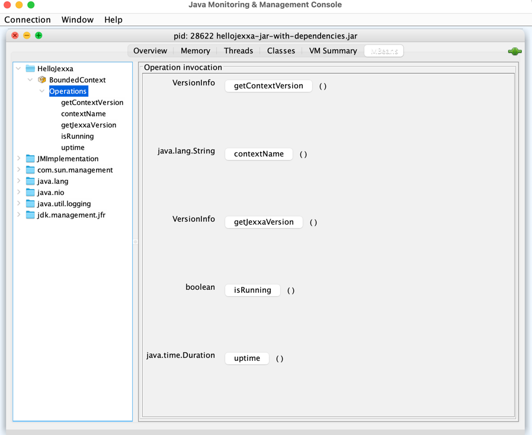

# HelloJexxa

## What You Learn

*   How to write a simple application using Jexxa
*   How to bind different driving adapter to the `BoundedContext` object which allow to control your application from outside
*   How to control the running application from outside via `BoundedContext` object 
*   How to use the `jexxa-application.properties` to configure the driving adapters    

## What you need

*   15 minutes
*   JDK 11 (or higher) installed 
*   Maven 3.6 (or higher) installed

## Write the application
The source code of the main method is quite obvious. Each line include comments to explain the meaning.  

```java     
public final class HelloJexxa
{
    public String greetings()
    {
        return "Hello Jexxa";
    }

    public static void main(String[] args)
    {
        //Create your jexxaMain for this application
        JexxaMain jexxaMain = new JexxaMain("HelloJexxa");

        jexxaMain
                // Bind a JMX adapter to our BoundedContext object.
                // It allows to access the public methods of the object via `jconsole`
                .bind(JMXAdapter.class).to(jexxaMain.getBoundedContext())

                // Bind a REST adapter to a HelloJexxa object
                .bind(RESTfulRPCAdapter.class).to(HelloJexxa.class)

                //Start Jexxa and all bindings
                // - Open following URL in browser to get greetings: http://localhost:7000/HelloJexxa/greetings
                // - You can also use curl: `curl -X GET http://localhost:7000/HelloJexxa/greetings`
                .start()

                //Wait until shutdown is called by one of the following options:
                // - Press CTRL-C
                // - Use `jconsole` to connect to this application and invoke method shutdown
                .waitForShutdown()

                //Finally invoke stop() for proper cleanup
                .stop();
    }
}
```
## Compile & Start the Application

```console                                                          
mvn clean install
java -jar target/hellojexxa-jar-with-dependencies.jar
```
You will see following (or similar) output
```console
[main] INFO io.jexxa.core.JexxaMain - Start BoundedContext 'HelloJexxa' with 2 Driving Adapter 
[main] INFO org.eclipse.jetty.util.log - Logging initialized @446ms to org.eclipse.jetty.util.log.Slf4jLog
[main] INFO io.javalin.Javalin - Starting Javalin ...
[main] INFO io.javalin.Javalin - Listening on http://localhost:7000/
[main] INFO io.javalin.Javalin - Javalin started in 194ms \o/
[main] INFO io.jexxa.core.JexxaMain - BoundedContext 'HelloJexxa' successfully started in 0.549 seconds
```

### Access the application via web browser
*   Get name of the bounded context:
    *   URL: http://localhost:7000/HelloJexxa/greetings
    *   Result: 
    ```Json 
        Hello Jexxa 
    ```
    
### Access the application JConsole

*   Start jconsole and select the MBean `BoundedContext` as shown in screenshot below
*   Now you can execute all methods of this object 
*   Execute `shutdown` to end the application 

 

### Adjust properties
In this simple tutorial `jexxa-application.properties` includes only the two parameters for RESTFulRPCAdapter. 
The most interesting one here is `io.jexxa.rest.port` that allows to define the used network port. 

```properties                                                          
#Settings for RESTfulRPCAdapter
io.jexxa.rest.host=localhost
io.jexxa.rest.port=7000
```
                                                          